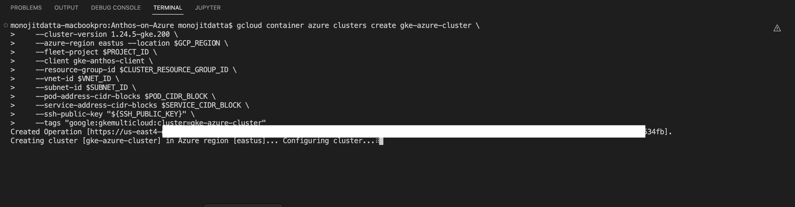
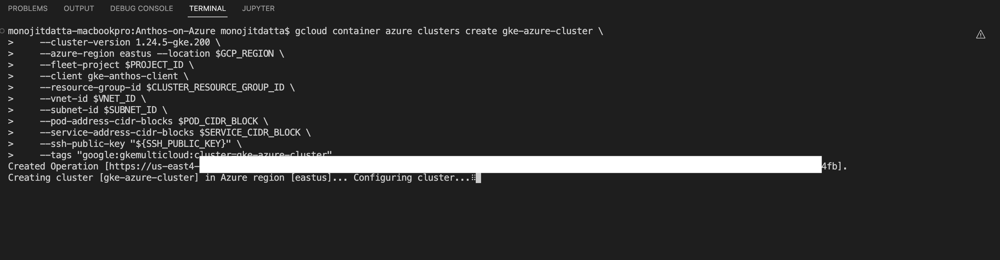
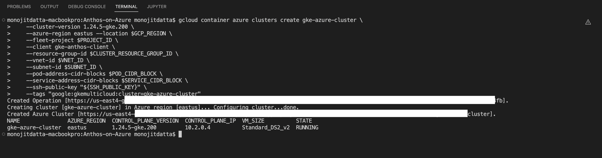
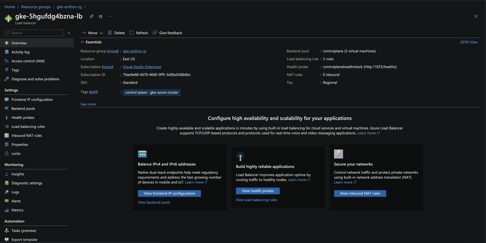
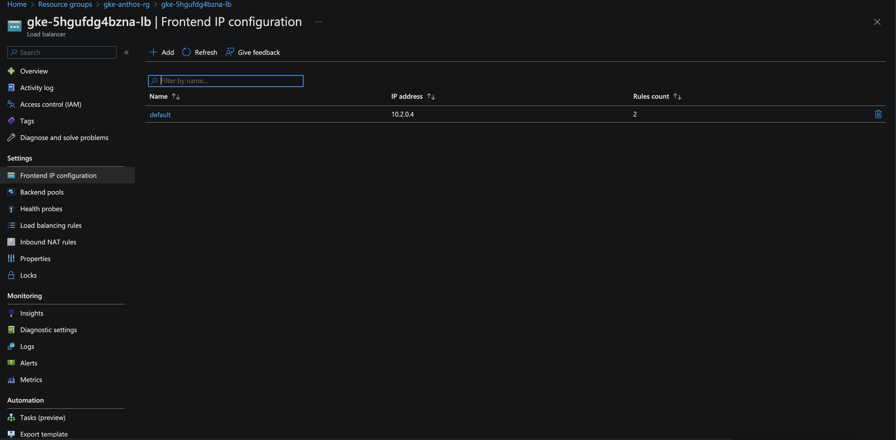
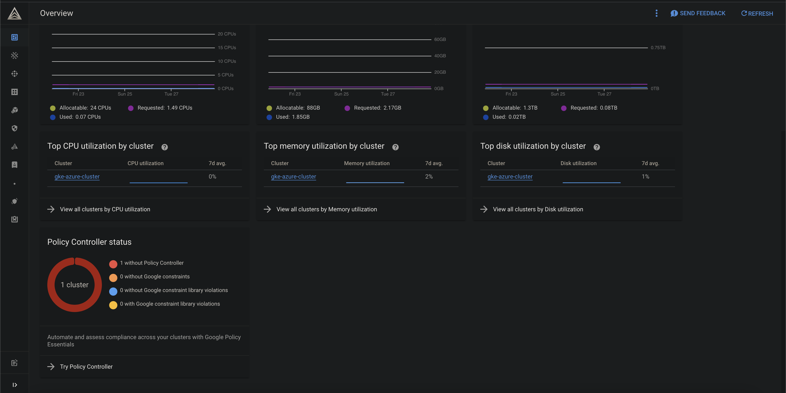

# Born and Nourished on GCP, Living on Azure

## Introduction

Today majority of the customers are looking towards multiple CSPs/Vendors to run their Cloud workloads at sccale and also run, manage, operate them seamlessly - whenver and wherever!

Single-cloud architecture is highly dependent on specific CSPs and their tools, services. Anthos provies a single pane of glass to manage workloads from multiple clouds with a unified management and configuration plane. Customers having containerized workloads that need to run on multiple clouds viz. AWS, Azure - can now be deployed, managed, configured from GCP Console or CLI. Moreover with the support for [Bare Metal](https://cloud.google.com/anthos/clusters/docs/bare-metal/latest), customers can now create, manage and operate K8s clusters on their own hardware.

This document would focus on an end to end implementation of creating and managing K8s cluster on Azure from GCP through Anthos. The following diagram depicts how Anthos simplifies the multi-cloud workload management.


## Anthos Technical Architecture


A [detailed technical overview](https://cloud.google.com/anthos/docs/concepts/overview) on Anthos multi-cloud depicts all its components and features and how it facilitates infrastructure management, confguration and application deloyment acorss multiple environments.

## Anthos on Azure


Following is a list of Core components that are relevant to this discussion i.e. **[Anthos for Azure](https://cloud.google.com/anthos/clusters/docs/multi-cloud/azure)**

- **Anthos on Azure**
  - All components are hosted on the customer's Azure environment
  - Anthos only manages its own services that are running on the K8s cluster on Azure
  - The **Control Plane** Instances and **Worker Node Pools** are all managed by Azure only
- **Multi-cluster management**
  - Anthos provides a Fleet manager to host multiple K8s clusters
  - [Anthos Multi-cloud API](https://cloud.google.com/anthos/clusters/docs/multi-cloud/reference/rest) allows GCP to create resources onto Azure platform of Customer on their behalf.
  - A [Connect Agent](https://cloud.google.com/anthos/fleet-management/docs/connect-agent) deployment is used to establish a connection between the cluster and GCP project. GCP console can get information about the K8s workload running on the cluster on Azure through Connect Agent deployment
  - Multiple clusters can be viewed and managed together in the **Anthos Dashboard**
- **Load balancers**
  - Provides integrations with Azure standard [Load balancers](https://cloud.google.com/anthos/clusters/docs/multi-cloud/azure/how-to/network-load-balancing)

## Steps to build this

Following are the steps we would follow as we move on:

- Create a **GCP project** to host all resources for Anthos on Azure

- Login to GCP Console with a **Service Account** or **User Account**

- Login and Connect to the Azure using **Azure CLI**

- Create a **Resource Group** to host all resources to be created for the K8s cluster

- Create **Azure Virtual Network** with a **/16** prefix and **Subnet** with a **/22** prefix to host K8s cluster resources

- Create an **Azure Public IP** and associate it with **NAT gateway**. And then associate it with the *Subnet* for K8s cluster create above

- Create **Service Principal** object on **Azure AD**

  - Create an **Azure AD Appliation** which generates an **ApplicationID**
  - Create a **Service Principal** object for this **ApplicationID**

- Configure **RBAC** on Azure

  - Assign **Contributor** role to the above **Service Principal** on the entire **Resource Group**
  - Assign **User Access Administrator** role to the above **Service Principal** on the entire **Resource Group**
  - Assign **Key Vault Administrator** role to the above **Service Principal** on the entire **Resource Group**

- Create an **AzureClient** resource on GCP

  - **AzureClient** resource will be created with the **Azure AD Service Principa**l
  - **Anthos** will authenicate with Azure while calling their REST APIs etc. as the **Azure AD Service Principal**

- Configure **RBAC** on GCP

  - Assign **gkehub.gatewayAdmin** role to the authenticated account for the entire GCP project
  - Assign **gkehub.viewer** role to the authenticated account for the entire GCP project

- Create the **Anthos** Cluster for Azure on GCP. This only creates the *Control Plane* of the K8s cluster on Azure

- Create the **System Nodepool** with **Virtual Machine Scale Set (VMSS)** on Azure; to host subsequent workloads

  > **TIP**
  >
  > Ideally, 
  >
  > - We should create additional workload specific **Nodepools**
  > - Use **Default nodepool** for K8s system specific workloads only

  

- Connect to the **K8s Cluster** on Azure

- Deploy couple of simple micro-services onto the K8s cluster on Azure

- Test the applications end to end

## Let us delve into this

### Prerequisites

- An active GCP Subscription
- A Github account (optional)
- [kubectl](https://kubernetes.io/docs/tasks/tools/)
- [gcloud sdk](https://cloud.google.com/sdk/docs/install-sdk)
- An Active Azure Subscription
- [Azure CLI](https://learn.microsoft.com/en-us/cli/azure/)
- [Visual Studio Code](https://code.visualstudio.com/download) (*Optional*) or any other preferred IDE

### Prepare Environment

Let us prepare the environment first

- Setup **Environment** variables

  ```bash
  #Azure variables
  RESOURCE_GROUP="<resource_group>"
  VNET_NAME="<vnet_name>"
  SUBNET_NAME="<subnet_name>"
  AZ_LOCATION="eastus"
  NGW_PUBLIC_IP="<ngw_public_ip>"
  NGW_NAME="<ngw_name>"
  AZ_AD_APP="<az_ad_app>"
  
  #GCP variables
  PROJECT_NAME="<project_name>"
  GCP_REGION="us-east4"
  SA_NAME="<saname>"
  GSA="$SA_NAME@${PROJECT_NAME}.iam.gserviceaccount.com"
  POD_CIDR_BLOCK="10.3.0.0/16"
  SERVICE_CIDR_BLOCK="10.4.0.0/16"
  VERSION="1.24.5-gke.200"
  USER=$(gcloud auth list --filter="account:admin*" --format="value(account)")
  CLUSTER="gke-azure-cluster"
  AZURE_CLIENT_NAME="gke-anthos-client"
  ```

- Login to **Azure CLI**

  ```bash
  az login
  ```

- Create a **Resource Group** on Azure

  ```bash
  az group create --name $RESOURCE_GROUP --location $AZ_LOCATION
  
  #Sample Output
  {
    "id": "/subscriptions/<sub-id>/resourceGroups/<resource_group>",
    "location": "<azure-location>",
    "managedBy": null,
    "name": "<resource_group>",
    "properties": {
      "provisioningState": "Succeeded"
    },
    "tags": null,
    "type": "Microsoft.Resources/resourceGroups"
  }
  ```

- Create **Azure Virtual Network** and **Subnet**

  ```bash
  az network vnet create \
    --name $VNET_NAME \
    --location $AZ_LOCATION \
    --resource-group $RESOURCE_GROUP \
    --address-prefixes 10.2.0.0/16 \
    --subnet-name $SUBNET_NAME \
    --subnet-prefix 10.2.0.0/22
  ```

- Create an **Azure Public IP**

  ```bash
  az network public-ip create \
    --name $NGW_PUBLIC_IP \
    --location $AZ_LOCATION \
    --resource-group $RESOURCE_GROUP \
    --allocation-method Static \
    --sku Standard
  ```

- Create **NAT gateway**

  ```bash
  az network nat gateway create \
    --name $NGW_NAME \
    --location $AZ_LOCATION \
    --resource-group $RESOURCE_GROUP \
    --public-ip-addresses $NGW_PUBLIC_IP \
    --idle-timeout 10
  ```

- Associate **Public IP** with *NAT gateway*

  ```bash
  az network vnet subnet update \
    --name $SUBNET_NAME \
    --vnet-name $VNET_NAME \
    --resource-group $RESOURCE_GROUP \
    --nat-gateway $NGW_NAME
  ```

  

- Create **Service Principal** object on **Azure AD**

  ```bash
  az ad app create --display-name $AZ_AD_APP
  ```

- Create a **Service Principal** object for this **ApplicationID**

  ```bash
  APPLICATION_ID=$(az ad app list --all \
   --query "[?displayName==$AZ_AD_APP].appId" \
   --output tsv)
   
  az ad sp create --id '$APPLICATION_ID'
  ```

- Configure **RBAC** on Azure

  ```bash
  APPLICATION_ID=$(az ad app list --all \
      --query "[?displayName==$AZ_AD_APP].appId" \
      --output tsv)
  SERVICE_PRINCIPAL_ID=$(az ad sp list --all --output tsv \
        --query "[?appId=='$APPLICATION_ID'].id")
  SUBSCRIPTION_ID=$(az account show --query "id" --output tsv)
  TENANT_ID=$(az account list \
    --query "[?id=='$SUBSCRIPTION_ID'].{tenantId:tenantId}" --output tsv)
  echo $APPLICATION_ID $SERVICE_PRINCIPAL_ID $SUBSCRIPTION_ID $TENANT_ID
  
  #Role Assignments
  
  #Contributor
  az role assignment create \
    --role "Contributor" \
    --assignee "${APPLICATION_ID}" \
    --scope "/subscriptions/${SUBSCRIPTION_ID}/resourceGroups/$RESOURCE_GROUP"
  
  #User Access Administrator
  az role assignment create \
    --role "User Access Administrator" \
    --assignee "${APPLICATION_ID}" \
    --scope "/subscriptions/${SUBSCRIPTION_ID}/resourceGroups/$RESOURCE_GROUP"
    
   #Key Vault Administrator
   az role assignment create \
    --role "Key Vault Administrator" \
    --assignee "${APPLICATION_ID}" \
    --scope "/subscriptions/${SUBSCRIPTION_ID}/resourceGroups/$RESOURCE_GROUP"
  ```

- Create an **AzureClient** resource on GCP

  ```bash
  gcloud services enable gkemulticloud.googleapis.com --project=$PROJECT_NAME
  
  gcloud container azure clients create $AZURE_CLIENT_NAME \
  --location=$GCP_REGION \
  --tenant-id="${TENANT_ID}" \
  --application-id="${APPLICATION_ID}"
  
  #Retrieve public Key info of the AzureClient Certificate
  CERT=$(gcloud container azure clients get-public-cert --location=$GCP_REGION gke-anthos-client)
  
  #Update credentials of Azure AD Application with the public Key of Certificate
  az ad app credential reset --id "${APPLICATION_ID}" --cert "${CERT}" --append
  
  #Sample output
  {
    "appId": "<appId>",
    "password": null,
    "tenant": "<tenantId>"
  }
  
  ```

- Configure **RBAC** on GCP

  ```bash
  gcloud projects add-iam-policy-binding $PROJECT_NAME \
    --member="serviceAccount:$PROJECT_NAME.svc.id.goog[gke-system/gke-telemetry-agent]" \
    --role=roles/gkemulticloud.telemetryWriter
  
  gcloud projects add-iam-policy-binding $PROJECT_NAME \
    --member="serviceAccount:<sa-name>@$PROJECT_NAME.iam.gserviceaccount.com" \
    --role=roles/gkehub.gatewayAdmin
  
  gcloud projects add-iam-policy-binding $PROJECT_NAME \
    --member="serviceAccount:<sa-name>@$PROJECT_NAME.iam.gserviceaccount.com" \
    --role=roles/gkehub.viewer
  
  gcloud projects add-iam-policy-binding $PROJECT_NAME \
  --member="user:$USER" --role=roles/gkehub.gatewayAdmin
  
  gcloud projects add-iam-policy-binding $PROJECT_NAME \
  --member="user:$USER" --role=roles/gkehub.viewer
  ```

- Create the **Anthos** Cluster for Azure on GCP

  ```bash
  ssh-keygen -t rsa -m PEM -b 4096 -C "GKE Anthos on Azure" -f ./gke-ssh-key -N "" 1>/dev/null
  SSH_PUBLIC_KEY=$(cat ./gke-ssh-key.pub)
  
  CLUSTER_RESOURCE_GROUP_ID=$(az group show --query id --output tsv --resource-group=$RESOURCE_GROUP)
  
  VNET_ID=$(az network vnet show --query id --output tsv --resource-group=$RESOURCE_GROUP --name=gke-anthos-vnet)
  SUBNET_ID=$(az network vnet subnet show --query id --output tsv \
  --resource-group=$RESOURCE_GROUP --vnet-name=gke-anthos-vnet --name=anthos-cluster-subnet)
  
  gcloud container azure clusters create $CLUSTER \
      --cluster-version $VERSION \
      --azure-region eastus --location $GCP_REGION \
      --fleet-project $PROJECT_NAME \
      --client $CLUSTER \
      --resource-group-id $CLUSTER_RESOURCE_GROUP_ID \
      --vnet-id $VNET_ID \
      --subnet-id $SUBNET_ID \
      --pod-address-cidr-blocks $POD_CIDR_BLOCK \
      --service-address-cidr-blocks $SERVICE_CIDR_BLOCK \
      --ssh-public-key "${SSH_PUBLIC_KEY}" \
      --tags "control-plane=$CLUSTER" \
      --admin-users $USER
  ```

  

  

  

  

  

  #### View on Azure

  

  

  

- Create the **System Nodepool** with **Virtual Machine Scale Set (VMSS)** on Azure

  ```bash
  gcloud container azure node-pools create system-pool \
      --cluster $CLUSTER \
      --location $GCP_REGION \
      --node-version $VERSION \
      --vm-size Standard_DS4_v2 \
      --max-pods-per-node 50 \
      --min-nodes 3 \
      --max-nodes 5 \
      --ssh-public-key "${SSH_PUBLIC_KEY}" \
      --subnet-id $SUBNET_ID
  ```

  

  

  #### View on Azure

  

  

  

  

- Connect to the **K8s Cluster** on Azure

  ```bash
  #Retrieve Cluster details
  
  #Describe the K8s cluster on Azure
  gcloud container azure clusters describe $CLUSTER --location=$GCP_REGION
  
  #Connect the K8s cluster on Azure
  gcloud container azure clusters get-credentials $CLUSTER --location=$GCP_REGION
  
  #List all Nodepools
  gcloud container azure node-pools list --cluster=$CLUSTER --location=$GCP_REGION
  ```

  

  

- Deploy micro-services onto the **K8s cluster** on Azure

  ```bash
  #Create K8s secret to hold docker credentials
  kubectl create secret docker-registry registry-secret \
  --docker-server=<docker-serevr>\
  --docker-username=_json_key \
  --docker-email=$GSA \
  --docker-password="$(cat <sa-name>.json)"
  
  #Create deployment
  kubectl create deployment hello-deploy --image=<docker-repo>/httpd:latest \
  --dry-run=client -o yaml > hello-deploy.yaml
  
  #Expose deployment as a Loadbalancer Service
  kubectl expose deployment hello-deploy --name hello-svc --type LoadBalancer --port 80 --dry-run=client -o yaml > hello-svc.yaml
  
  #Create deployment
  kubectl create deployment nginx-deploy --image=.<docker-repo>/nginx:latest \
  --dry-run=client -o yaml > nginx-deploy.yaml
  
  #Expose deployment as a Loadbalancer Service
  kubectl expose deployment nginx-deploy --name nginx-svc --type LoadBalancer --port 80 --dry-run=client -o yaml > nginx-svc.yaml
  ```

  ##### Services running on Azure; view from GCP

  

  

  ##### hello-svc Service running on the browser

  

  

  ##### nginx-svc Service running on the browser

  

  

- Visit **Azure Portal**; review resources created

  #### Load Balancers

  ##### Load Balancer for Control Plane of the K8s cluster

  

  

  ##### Frontend IP configuration

  

  

  ##### Backend pool mapped to Control Plane VMs

  

  

  ##### Load Balancer for the Worker Nodes of the K8s cluster

  .png)

  

  ##### Frontend IP configuration

  

  

  ##### Backend pool mapped to Worker Nodes

  


#### Observing the K8s cluster on Azure from GCP

##### Anthos Dashboard





##### Metrics Explorer

###### Memory Usage


###### CPU Usage


###### Log Bytes


### Conclusion

This document depicted how an end to end flow 